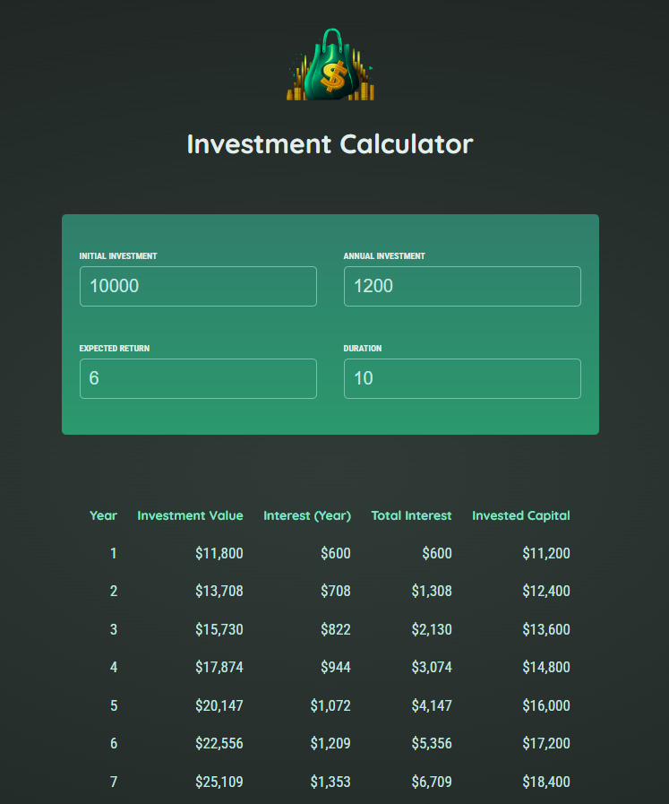

# Investment Calculator 📈

This Investment Calculator is a simple web application that helps users estimate their future wealth based on initial investment, annual contributions, expected return, and investment duration.

## Overview 🌐

The Investment Calculator provides users with a table of investment results, breaking down each year's investment value, interest, total interest, and invested capital. Users can input their financial details and receive a projection of their investment growth over time.


## Technologies Used 💻

- **React**
- **CSS**
- **JavaScript**



## Features 🎉

- User-friendly interface for inputting financial details.
- Dynamic calculation of investment results based on user input.
- Detailed results table showing investment breakdown for each year.

## Usage 📊

1. Clone the repository to your local machine.
2. Navigate to the project directory.
3. Open the terminal and run the following command to install dependencies:

```bash
npm install
```

- Start the project with:
```bash
npm start
```

## How to Use 🤔
1. Enter the initial investment amount.
2. Input the annual investment contribution.
3. Specify the expected annual return rate.
4. Set the investment duration in years.
5. View the detailed results table showing the investment breakdown for each year.


## Live Demo 🌐
Live Demo: [Investment Calculator](https://investment-calculator-three-smoky.vercel.app/)

## Contributing 🤝
Feel free to use, modify, and contribute to the project! If you have any questions or feedback, you can reach me at your nisagokdemir@gmail.com

## License
This project is licensed under the **MIT License**.
